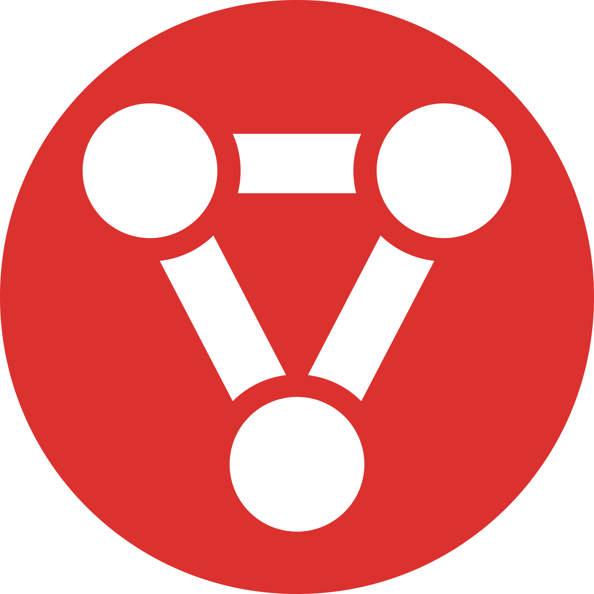
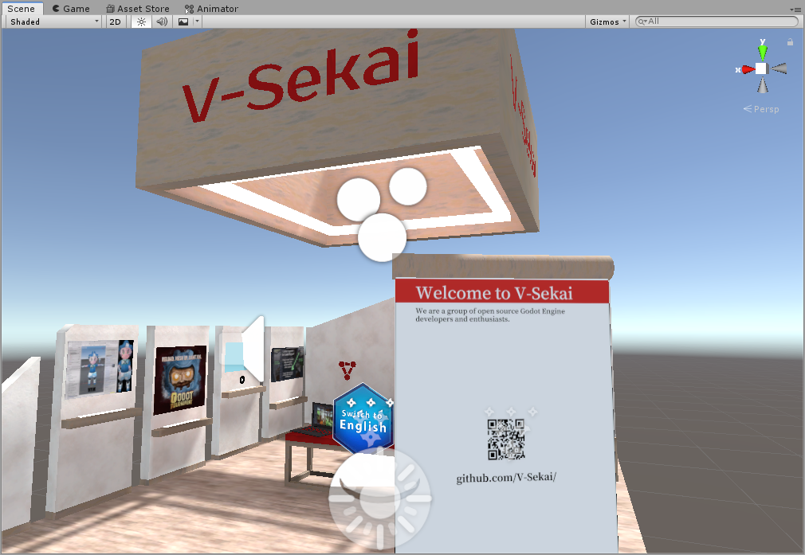
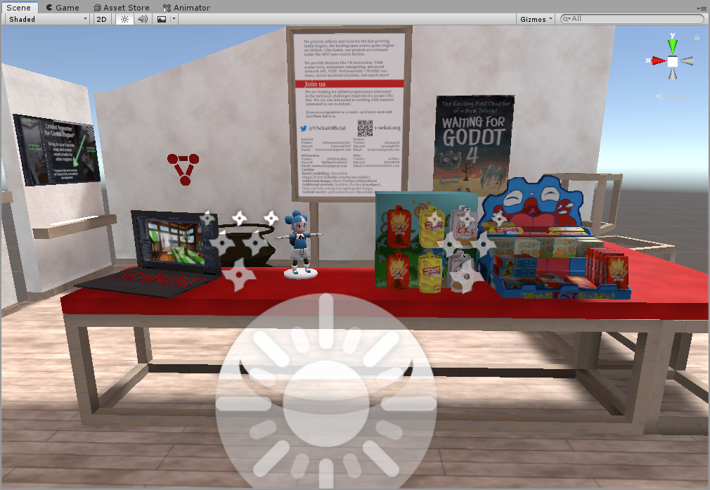
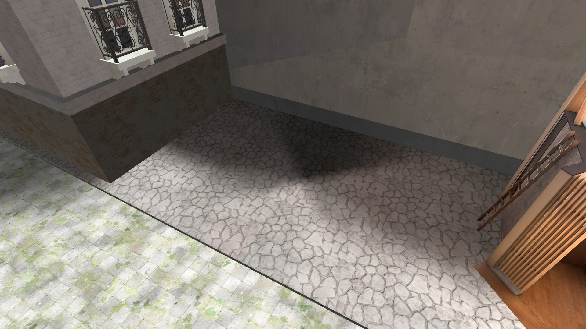
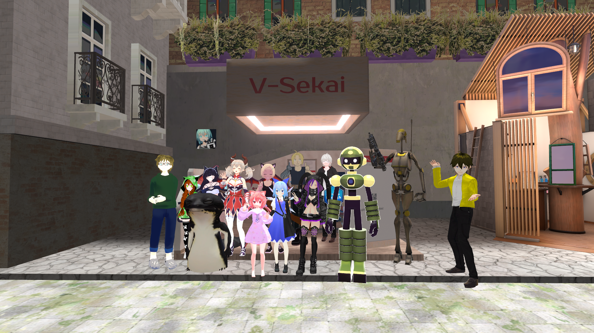

<caption>2021年08月18日(水) 16:00</caption>
     
## [English](a-statement-on-the-walled-metaverse.md) | 日本語

# 壁で囲まれたメタバース

 

８月14日、[Virtual Market 6](https://vket6.v-market.work/) という仮想世界への扉が開きました。このイベントは恐らく世界最大の VR 展示会で、過去の Virtual Market における来場者は数十万人にもおよびます。今回も以前と同様に、メインイベントは巨大なソーシャル VR プラットフォームである「VRChat」上で独占的に行われました。Virtual Market という名前の通り、販売を主軸としたイベントではありますが、多くのオープンソースプロジェクトや無料の商品の展示も行われています。

 

私たちのコミュニティは Virtual Market の会場の一つに、私たちが作ったアプリケーションを紹介するブースを展示することを決め、入稿を行い、そしてそれは受理されました。しかし、イベントの開催から２日後、VRChat, Inc. の利用規約に違反しているという理由で、私たちのブースは撤去されてしまいました。VRChat のこの決定は、現在のソーシャル VR プラットフォームは壁で囲まれた箱庭であるという危険性を示しているに他ならず、「VR プラットフォーム」という分野においてオープンな解決方法が必要であるという事を、改めて私たちに強く認識させました。

## 私たちは誰？ 

[V-Sekai](https://github.com/V-Sekai) は、オープンソースの VR プラットフォームをサポートするために必要な技術を構築することを目的とした、様々な分野の開発者が集まるコミュニティです。私たちは、GitHub におけるオープンソース・ゲームエンジンの代表格である [Godot Engine](https://godotengine.org) そのものや、様々な外部モジュールの開発を行うことを主な活動としています。これらを通じて、Unity や Unreal Engine のようなオープンでないゲームエンジンのしがらみから抜け出し、ソーシャル VR の分野だけでなく、より広い開発者のコミュニティに新たな活動を行う機会を提供したいと考えています。

私たちのグループは、Godot Engine において多くの [MIT ライセンス](https://opensource.org/licenses/MIT)のプロジェクトに携わってきました。バーチャルキャラクターモデルのフォーマットである VRM のサポート、Unity コンテンツのインポーター、IK やキャラクターアニメーションのリターゲットシステム、より強力なネットワーク API の提供、WebAssembly ベースのスクリプトエンジン、Godot Engine の VR サポートの改善、Godot エディターやアセットインポートパイプラインの改善、etc……。

## Virtual Market とは？

[Virtual Market](https://v-market.work/) は、数百にも上る個人製作者や企業が出展する大規模な VR 展示会です。日本では [Hikky Inc.](https://www.hikky.life/) が運営しており、彼らはインディーズゲームの展示会である「[GameVket](https://game.vket.com/)」やインディーズ音楽の展示会である「[MusiVket](https://music.vket.com/)」などの姉妹イベントも運営しています。

## 何が起こったの？

2021年08月16日

遡ること８月10日、私たちは一般公開に先立ち、Virtual Market のサポートデスクから「VRChat, Inc. が私たちのブースを VRChat の利用規約に違反していると判断した」というメッセージを受け取りました。その具体的な内容は、「VRChat の競合プラットフォームを宣伝しているように見える」というものでした。現時点においては V-Sekai はプラットフォームとしての体をなしておらず、この主張は受け入れがたいものでしたが……。それでも私たちは大幅な変更を行い、V-Sekai のブースは Godot Engine の為のオープンソースコミュニティとしての活動を宣伝する場となりました。

また、VRChat の利用規約を確認しましたが、競合するプラットフォームに関するような記述は見当たらず、私たちのブースがなんらかのルール違反をしている可能性を見つけることはできませんでした。私たちは VRChat 運営に説明を求めましたが、彼らは私たちと直接連絡を取ることを拒否した上で、「競合プラットフォームを宣伝することは規約で認められていない」と言い残し、それ以上この件についての話し合いの場は設けられませんでした。結果として、どのような修正を行えば私たちのブースを残すことが許されるのか、何一つとして提示される事はありませんでした。

私たちはブースを変更するにあたって、看板における文言に問題があったのではないかと考え、それらを削除しましたが、VRChat はそれでも不十分だと判断したようで、ブースの全面撤去を要求してきました。VRChat は展示会場（Lagna Fiore）の存在を許可するかどうかの最終的な決定権を持っているため、Virtual Market はそれに逆らうことができず、私たちのブースは大きな変更を行ったにもかかわらず、あっけなく撤去されてしまいました。
 

## 私たちの理念

プラットフォームホルダーには、自分たちのプラットフォームにおいて何が容認されるかを決定する法的な権利があります。しかし、その力を不当に行使してコミュニティを抑圧することは、アイデアやイノベーションの自由な共有を妨げるという「萎縮効果」をもたらします。これは、幅広い VR コミュニティや Godot Engine の開発者たちの為に OSS ツールを提供するというプロジェクトを行っている者として、私たちが深く憂慮していることです。

V-Sekai は、試験運用が十分に可能なオープンソースの VR 技術スタックを開発するという目的で始まりました。今日、V-Sekai は当初のビジョンをはるかに超えて成長し、今では仮想世界におけるオープンスタンダードやオープンソースソフトウェアを促進することに熱心な、オープンテクノロジーを愛する人たちによるグローバルなコミュニティとして盛り上がりを見せています。

## 最後に

2021年08月14日

私たちは、私たちと価値観を共有できる人に[私たちの Discord サーバーへの参加](https://discord.gg/2YwPmnbqcN)を呼びかけています。また、[Open Metaverse Interoperability](https://github.com/omigroup/OMI) グループが毎週行っている [Discord](https://discord.gg/NJtT9grz5E) や [GitHub](https://github.com/omigroup/OMI) のミーティングも覗いてみてください。そして、もしあなたが私たちのプロジェクトの行く末に興味を持ったのであれば、下記のリンク先をご覧になるか、下記の連絡先までメッセージをお送りください：

* ツイーターはこちら： https://twitter.com/VSekaiOfficial
* GitHub はこちら： https://github.com/V-Sekai/
* 私たちのサイト： https://v-sekai.org
* Discord： https://discord.gg/2YwPmnbqcN
