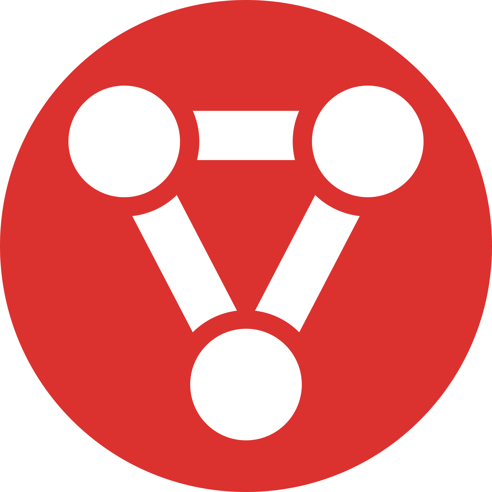
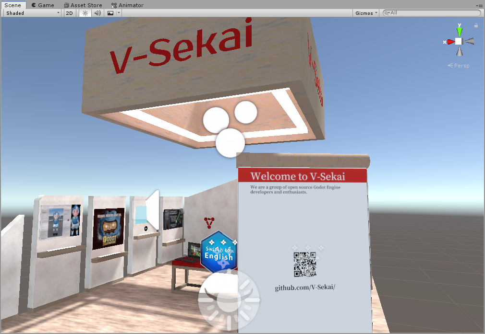
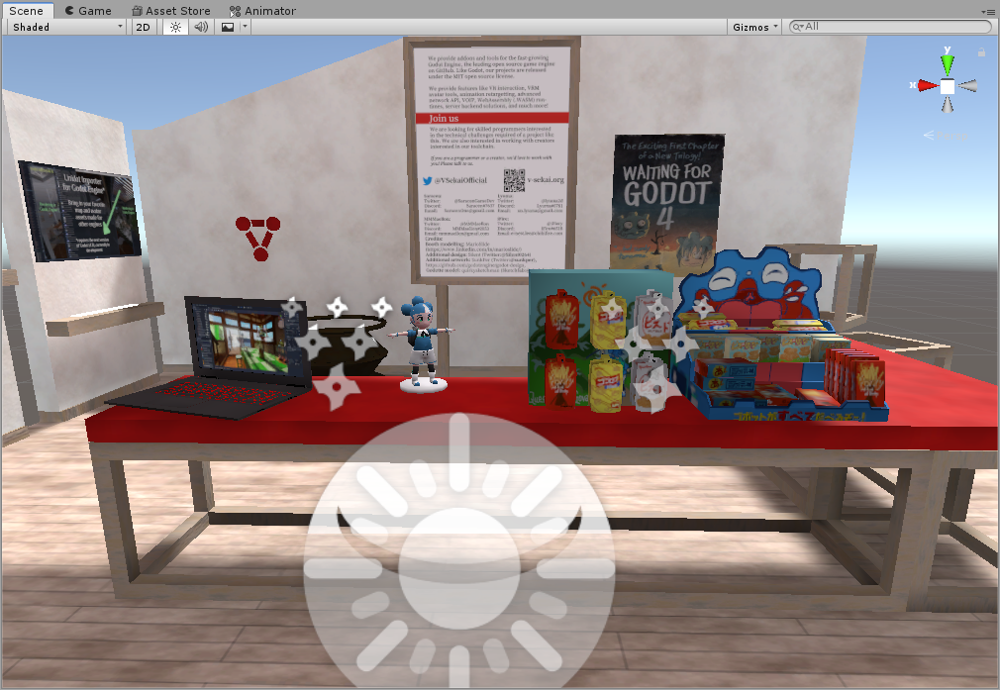
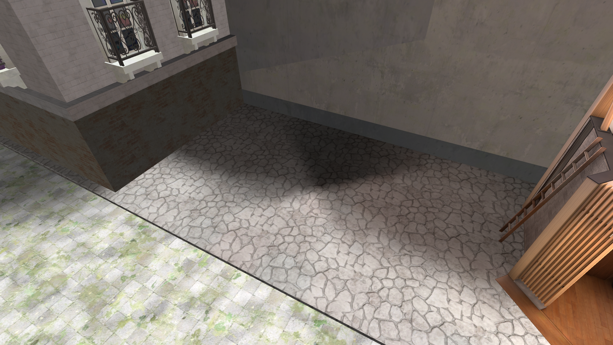
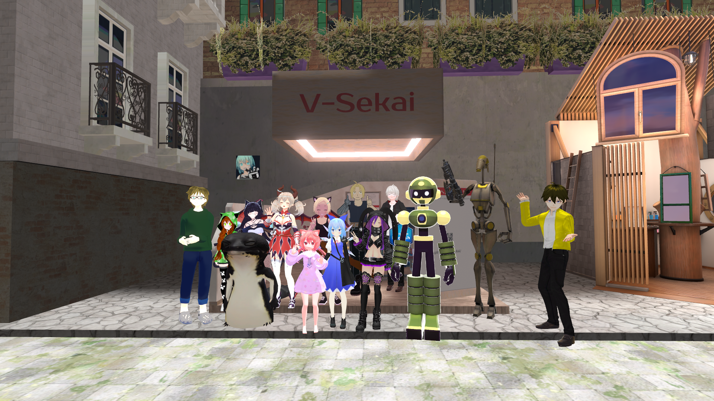

     
## English | [日本語](a-statement-on-the-walled-metaverse-ja.md)

# A statement on The Walled Metaverse

 

On August 14th, the virtual doors to [Virtual Market 6](https://vket6.v-market.work/) opened. It's probably the biggest virtual convention in the world, with previous versions of the event having welcomed hundreds of thousands of visitors. This year, like previous years, the main event was held on VRChat—a massive, proprietary social VR platform. Though the name suggests a focus on selling, Virtual Market also features exhibitions for many open-source projects and free works.

 

Our community, [V-Sekai](https://github.com/V-Sekai), decided to apply for a booth in one of their exhibition halls, and our application was accepted. But, two days after opening, our booth was removed for allegedly violating VRChat, Inc.’s terms of service. We believe this spotlights the danger of the walled gardens that currently make up the social VR space, and showcases the need for open solutions in this field.

## Who are we?  

[V-Sekai](https://github.com/V-Sekai) is a multi-disciplinary community of developers, working to build the technology necessary to support open-source VR platforms. Our main focus is building on the [Godot Engine](https://godotengine.org), the leading open source game engine on GitHub, where we work on both the core engine and many external modules. Through this, we hope to provide new opportunities not just for the social VR space, but also for the wider development community, by removing the ties to proprietary engines, like Unity and Unreal. 

Our group has worked on many [MIT Licensed](https://opensource.org/licenses/MIT) projects for Godot, including support for the VRM virtual character model format; an importer for Unitypackage content; systems for IK and character animation retargeting; more robust networking solutions; a WebAssembly-based scripting engine; improvements to Godot’s VR support; improvements to Godot’s editor and asset importing pipeline; and much more. 

## What is “Virtual Market”?

[Virtual Market](https://v-market.work/) is a large-scale virtual convention, featuring hundreds of indie and corporate exhibitors. It is run and managed by [Hikky Inc.](https://www.hikky.life/) in Japan, who also operate several sister events as well, including [GameVket](https://game.vket.com/) for indie games, and [MusicVket](https://music.vket.com/) for indie music. 

## What happened?

On the 10th of August, prior to the public venue opening, we received a message from Virtual Market support informing us that VRChat, Inc. deemed our booth to be in violation of VRChat’s terms. Specifically, they saw it as advertising a competing platform. From our perspective, it would be inaccurate to claim V-Sekai is a platform at present. Nevertheless, we made significant changes to our booth to focus solely on our open-source community work for the Godot Engine.

Though we examined VRChat's terms, we weren't able to find the term we violated, nor any remark on other platforms. We attempted to reach out to the VRChat team for clarification, but they would not communicate with us directly. Instead, we were told that "promoting another platform is not allowed by our terms" and moreover that there was no room for further debate over whether we were even promoting another platform or not. 

Though at first we understood that the issue was the wording of the front board, it turned out that that was not enough for VRChat, and they demanded the full removal of the booth. With VRChat retaining ultimate control over whether a venue is allowed to exist on the platform, Virtual Market was left with no choice but to remove our booth. 

 
## Our Statement

Platform holders have the legal right to control what’s on their platform, but when they wield their power to stifle the wider open source community, it creates a chilling effect that prevents free sharing of ideas and innovation. As a project which provides open-source tools for Godot developers and the wider VR community, this is something we are deeply concerned about.

V-Sekai began with the goal to create a fully capable open-source VR tech stack which could serve as a test bed for experimentation. Today, our group has grown beyond its original vision. It is now a thriving global community of open technology enthusiasts interested in furthering the vision of open standards and open-source software for virtual worlds.

## In Conclusion

We call on anyone who shares our values to [join us on Discord](https://discord.gg/2YwPmnbqcN). Get involved with the weekly meetings with the [Open Metaverse Interoperability group](https://github.com/omigroup/OMI) [on Discord](https://discord.gg/NJtT9grz5E) and [on GitHub](https://github.com/omigroup/OMI). If you’re interested in the future of our projects, check out our links below or send us a message at our contact info below:

* Twitter: https://twitter.com/VSekaiOfficial
* GitHub organization: https://github.com/V-Sekai/
* Website: https://v-sekai.org
* Discord: https://discord.gg/2YwPmnbqcN
